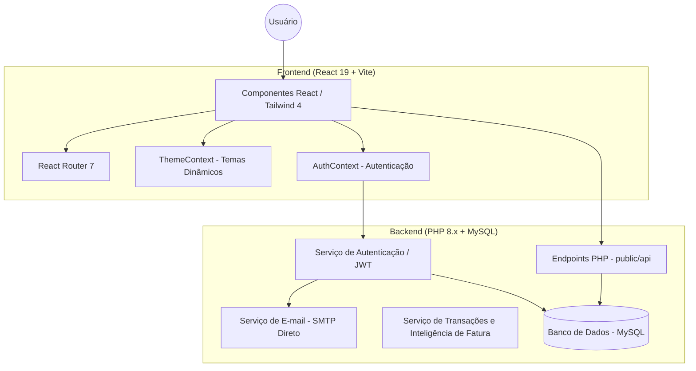
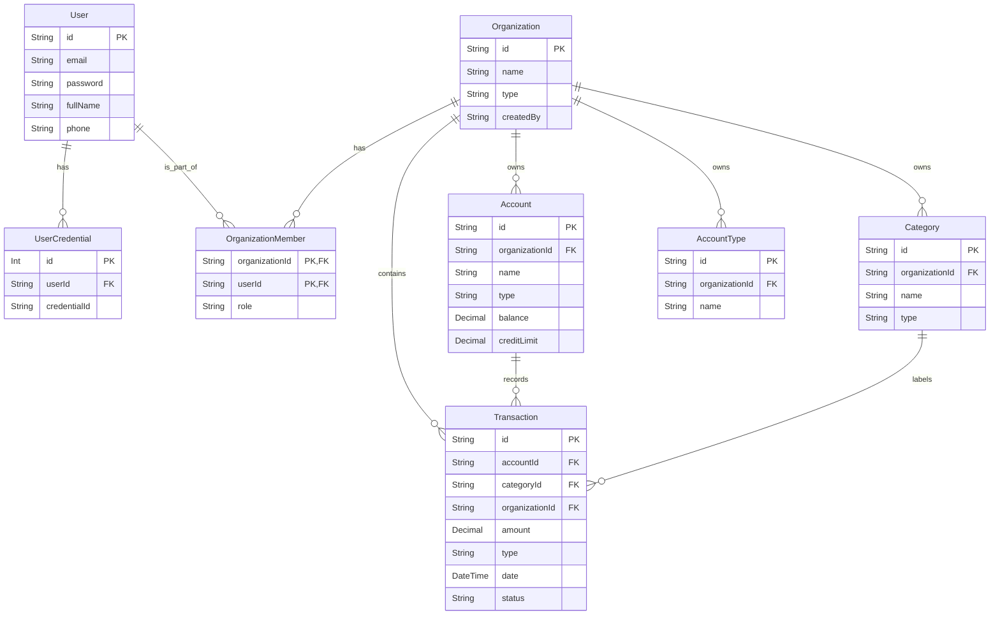

# Sistema de Gestão Financeira Premium (Vite + PHP)

Um sistema SaaS de gerenciamento financeiro moderno, rápido e altamente personalizável, construído com **React 19** e **PHP 8**. 
Desenvolvido com um foco implacável em UX/UI, este projeto utiliza as abordagens mais sofisticadas de design responsivo, animações micro-interativas e tratamento inteligente no Backend para operações massivas como faturas de cartão de crédito.

## 🚀 Tecnologias

- **Frontend**: React 19, Vite, Tailwind CSS 4, React Router 7.
- **Backend**: PHP 8.1+, MySQL (PDO Nativo).
- **ORM & Types**: Prisma Client (Apenas para documentação de schema, **NÃO** usado em runtime de query do Backend).
- **UI/UX**: Lucide Icons, Recharts, Framer Motion, e padrões profundos de _Glassmorphism_ em modo Dark de baixo contraste.
- **Segurança**: Autenticação Proprietária `PASSWORD_ARGON2ID` no PHP com tokens rotativos e cookies de Sessão.

## 🏗️ Arquitetura do Sistema



## 📊 Modelo de Dados
O mapeamento oficial das estruturas está definido no arquivo `prisma/schema.prisma`. 

### Diagrama de Domínio (ER)



> **🚨 AVISO CRÍTICO DE ENGENHARIA:** 
> Nunca rode `npx prisma db push --accept-data-loss` neste repositório. O banco sofreu mutações orgânicas em sua autenticação (Users) e regras de negócio (Cartão de Crédito) que requerem extrema precaução. Apenas adicione migrações com scripts manuais caso o Schema do Prisma diverja do estado real.

### Regras de Negócio Críticas Aplicadas no Banco:
* **`ACCOUNTS`**: Além de saldo e organização, tipos marcados como "Cartão de Crédito" (`creditLimit`) exigem as chaves lógicas de ciclo de vida financeiro `closingDay` (Dia de Fechamento) e `dueDay` (Dia de Vencimento).
* **`TRANSACTIONS`**: Responsável por todo o fluxo de caixa, as transações recebem tags estendidas: `status`, `payment_date`, e `is_fixed`.

## 💳 Inteligência de Cartão de Crédito
A aplicação possui um motor de simulação de Faturas de Cartão de Crédito de altíssimo nível. 
1. Ao invés de perguntar a data manual da parcela, a API intercepta **compras parceladas**.
2. Verifica em que dia a compra está ocorrendo em relação ao `closingDay` da conta atrelada ao Cartão de Crédito.
3. Se a fatura atual já "virou", a primeira parcela é jogada automaticamente no `dueDay` do *próximo mês subsequente*, mapeando a cascata completa das *N* parcelas exatas ao longo do ano faturado.

## 🛠️ Como Rodar o Projeto

O projeto funciona com dois processos simultâneos: o servidor de desenvolvimento do Frontend (Vite) e o servidor da API (PHP).

### 1. Requisitos
- Node.js 18+
- PHP 8.1+ (Exigência para Argon2id Hashing e Nullsafe Operators).
- MySQL 8.0

### 2. Configuração do Backend (API)
A API reside em `public/api`.
- Configure sua conexão com o banco de dados editando o arquivo `public/api/db.php` (Configure constantes de Email e PEPPER para senhas fortes).
- Inicie o servidor PHP apontando o root para a pasta `public`:
  ```bash
  php -S localhost:8000 -t public
  ```

### 3. Configuração do Frontend
Vá para a pasta raiz do projeto:
```bash
npm install
npm run dev
```
O frontend estará servido em `http://localhost:5173/financas`.

## 📝 Últimas Atualizações (Changelog)

- **Layout Mobile de Transações:** Ajuste de responsividade no Resumo do Painel (Receitas, Despesas, Balanço). Transição de container flex para Grid (3 colunas), garantindo alinhamento e leitura confortável de métricas grandes no celular.
- **Relatórios Dinâmicos (Date Filter):** O engessado seletor de "Este Mês / Este Ano" foi substituído pelo componente inteligente `<DateFilter />`. A API de backend (`dashboard.php`) foi adaptada para interpretar requisições amplas via `startDate` e `endDate`, destravando o poderoso recurso de "Todos os Meses".

## ✨ Principais Destaques do Projeto

- **Filtro Temporal Dinâmico ("Todos os Meses"):** Quebra a barreira da clássica navegação mensal por "Setas" num botão central de Filtro de Séries Temporais, dando visão global do saldo das contas.
- **Skins Premium**: Sistema dinâmico e visualmente leve baseada em Tokens CSS no Tailwind.
- **Painéis Escuros Fluídos (Glassmorphism)**: Efeito Translúcido responsivo que acompanha a rolagem suave.
- **Multi-tenancy Absoluto**: Isolamento total de dados no Backend PHP entre diferentes organizações e usuários.
- **Recuperação de Senha Segura**: Fluxo local forte com geração segura de tokens em criptografia nativa no backend.
- **Design Adaptativo com Bloqueadores (Fixes)**: Interface que reconhece o tamanho do Drawer (Modal) em notebooks e habilita `overflow-y-auto`, não omitindo o rodapé da página.

## 📁 Estrutura de Pastas e Conhecimento

Para futuras integrações do Agente, as documentações das regras estruturais residem em:
- `/frontend`: Aplicação SPA principal.
- `/public/api`: Endpoints RESTFul em raw PHP.
- `/.agent/skills/financas-app/`: **SKILL** proprietária descrevendo comportamentos proibitivos de arquitetura.

---
*Desenvolvido e atualizado com inteligência via Antigravity Toolkit para gerir ativos de classe mundial.*
