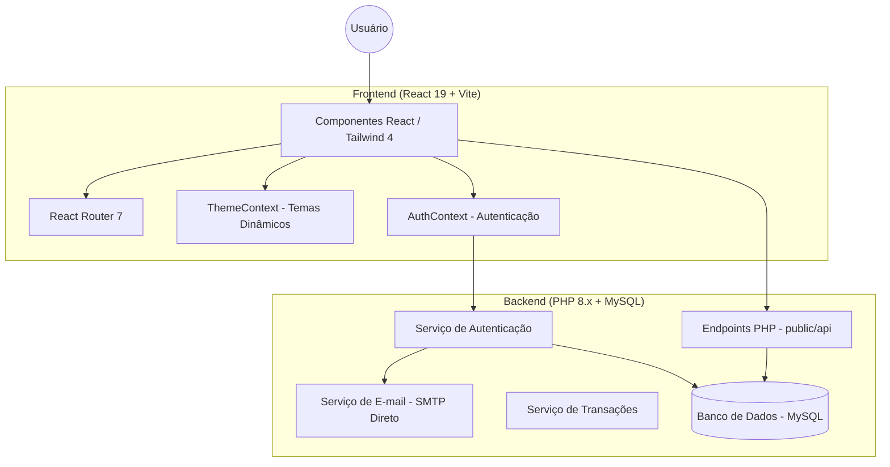
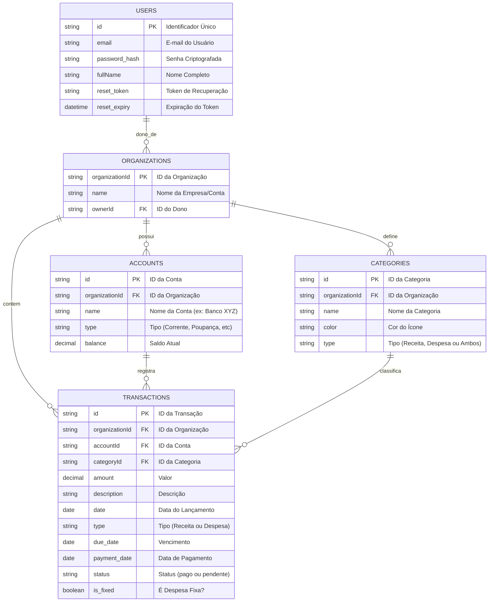

# Sistema de Gestão Financeira Premium (Vite + PHP)

Um sistema SaaS de gerenciamento financeiro moderno, rápido e altamente personalizável, construído com React 19 e PHP 8.

## 🚀 Tecnologias

- **Frontend**: React 19, Vite, Tailwind CSS 4, React Router 7.
- **Backend**: PHP 8.1+, MySQL.
- **UI/UX**: Lucide Icons, Recharts, Animações Framer Motion.

## 🏗️ Arquitetura do Sistema



## 📊 Modelo de Dados



## 🛠️ Como Rodar o Projeto

O projeto funciona com dois processos simultâneos: o servidor de desenvolvimento do Frontend (Vite) e o servidor da API (PHP).

### 1. Requisitos
- Node.js 18+
- PHP 8.1+
- MySQL 8.0

### 2. Configuração do Backend (API)
A API reside em `public/api`.
- Configure sua conexão com o banco de dados em `public/api/db.php`.
- Inicie o servidor PHP (ou use Apache/Nginx apontando para `public`):
  ```bash
  php -S localhost:8000 -t public
  ```

### 3. Configuração do Frontend
Vá para a pasta raiz do projeto:
```bash
npm install
npm run dev
```
O frontend estará disponível em `http://localhost:5173/financas`.

## ✨ Destaques do Projeto

- **Skins Premium**: Sistema de temas dinâmicos (Midnight, Emerald, Ocean, Gold, Light).
- **Multi-tenancy**: Isolamento total de dados por organização via backend PHP.
- **Recuperação de Senha**: Sistema seguro de "Esqueci minha senha" com SMTP direto e tokens de segurança.
- **Gestão de Vencimentos**: Controle inteligente de despesas fixas com alertas de atraso.
- **Filtros Avançados**: Visualização segmentada por Receitas, Despesas ou Ambos nas transações.
- **Dashboard Analítico**: Gráficos analíticos para categorias e fluxo de caixa.
- **Segurança**: Proteção contra Host Header Injection, diálogos de confirmação em ações críticas e feedback instantâneo via Toasts.
- **Internacionalização (PT-BR)**: Formatação automática de moeda e decimais para o padrão brasileiro.

## 📁 Estrutura de Pastas

- `/frontend`: Aplicação React (Vite).
- `/public/api`: Endpoints PHP (Backend).
- `/public/api/auth`: Módulos de autenticação e segurança.
- `ARCHITECTURE.md`: Documentação técnica completa.

---
*Desenvolvido por Antigravity (Google Deepmind) para o usuário*
